# Story Sharing

Story Sharing is a multi writer blogger website. Here writer can write their own story/post, they can other writer post like, comment,
In This Project build I use Nodejs, React and Mongodb, Redis as a caching storage

### Github Repo Client : https://github.com/rasel-mahmud-dev/story-sharing-frontend
### Github Repo Backend: https://github.com/rasel-mahmud-dev/story-sharing-backend

### This Application under development

Live Link https://story-sharing.netlify.app

## Application Features
- Multiple writer can writer own post. also have user and admin role. admin can access everything.
- User can create account with google, facebook, or and email/password base system.
- Implement nice network data loading skeleton. 
- user they can recover password if forgot.
- user have a dashboard, there they can see all post that written by them. 
also user can update their profile information line avatar, cover photo, name, email, password.
- buyer can order, add wishlist, and see their past all transaction.
- Other Side a seller can add/update, delete product. they can manage their product.
- And admin can block a writer.
- For security, I use route middle that check user role everytime when they move different route.
  if they are not permitted then simply them push home or login route
   
   
- Also, user can quickly find blog post by search

## Technology used.

- Reactjs
- redux
- react-redux
- react-router-dom
- Tailwindcss
- react-markdown-editor
- react-transition-group
- sass
- highlight.js
- react-helmet
- fortawesome
- axios

### Preview screenshot

####  Homepage
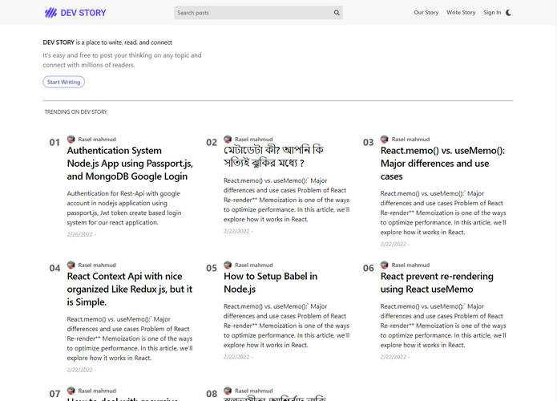
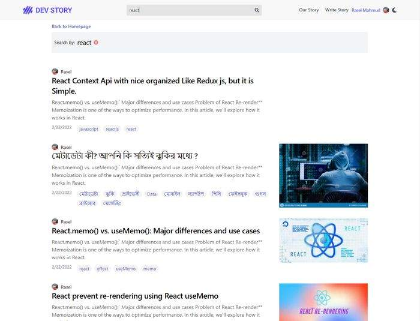
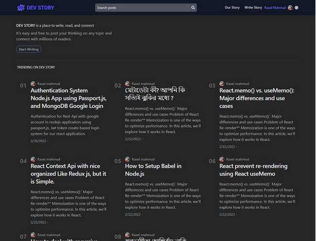
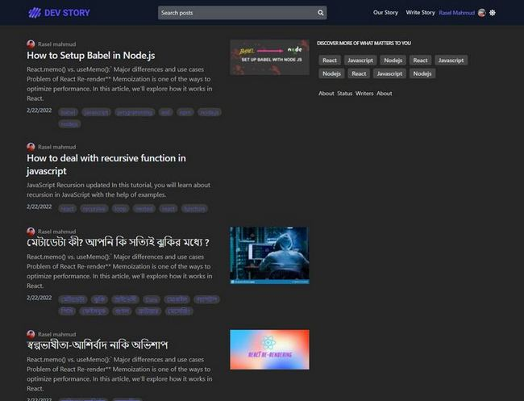

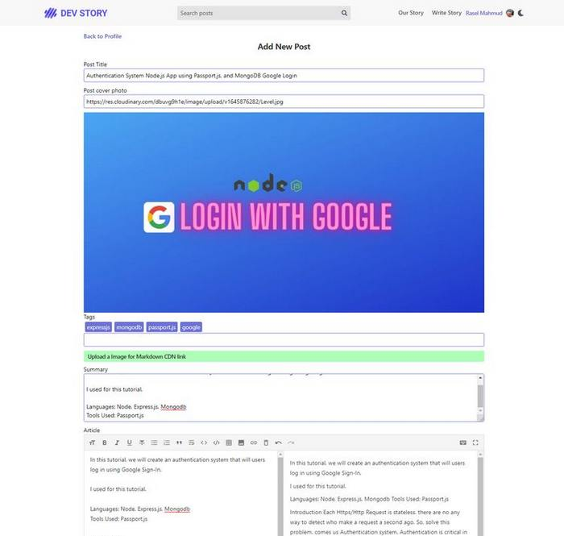
 

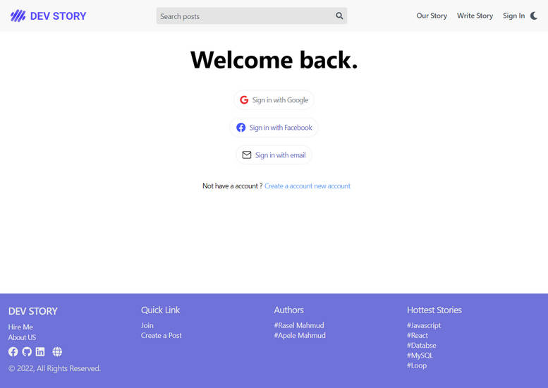
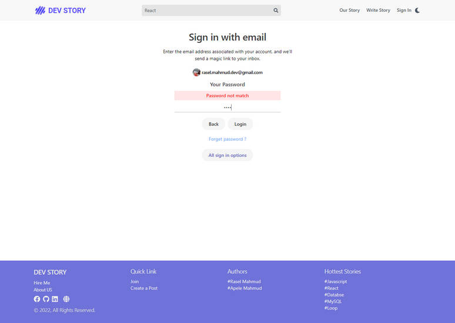
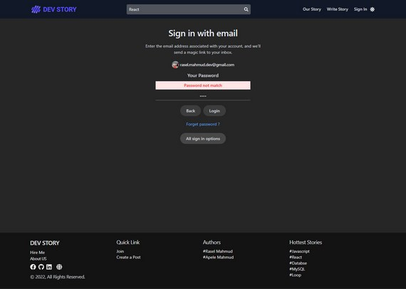
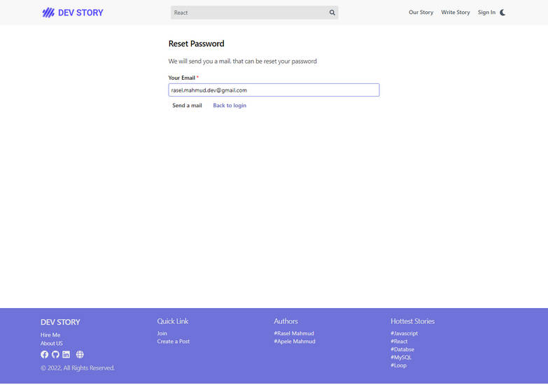
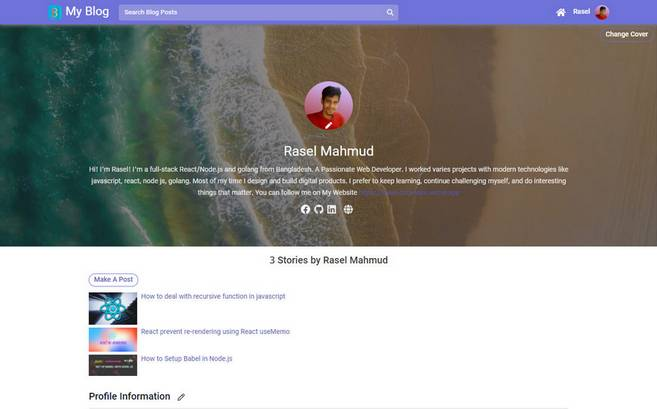

 
 

#### Post details Page
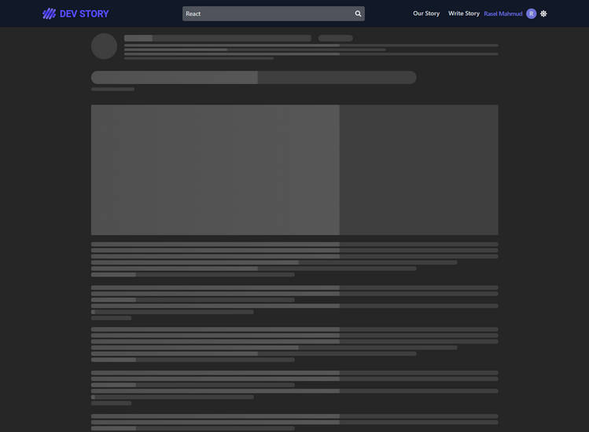
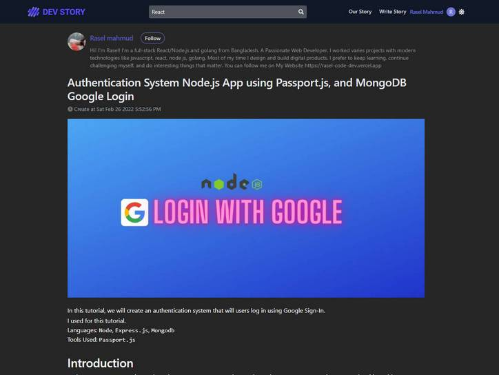
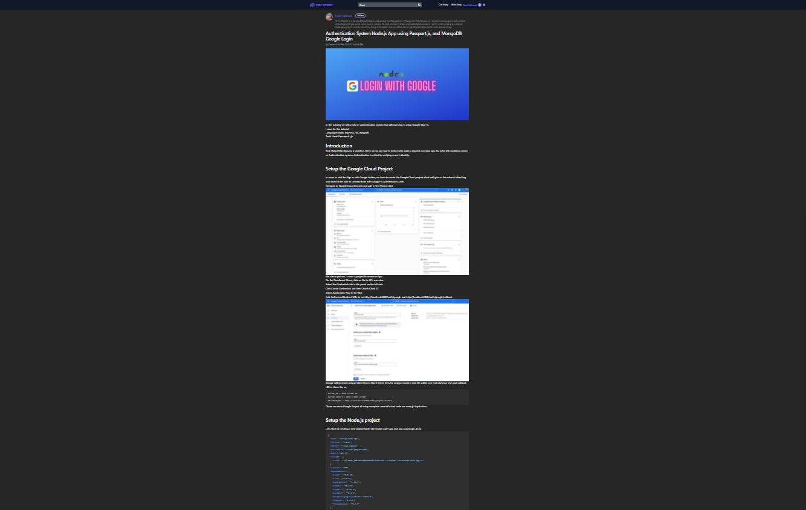
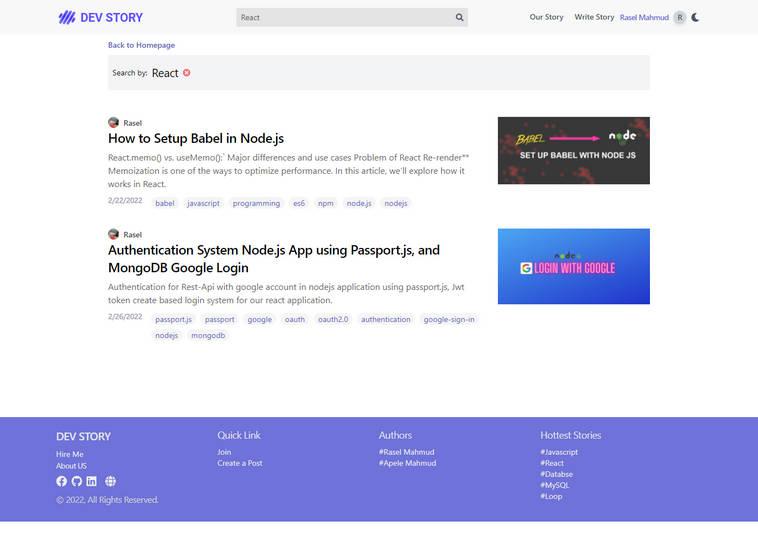
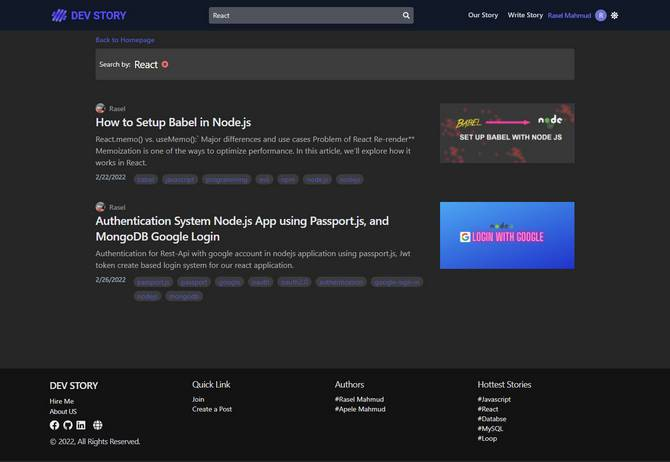

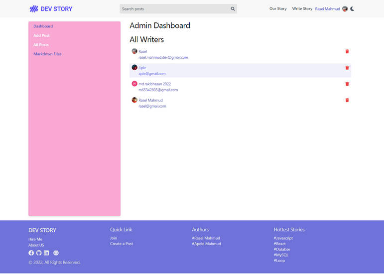
 
